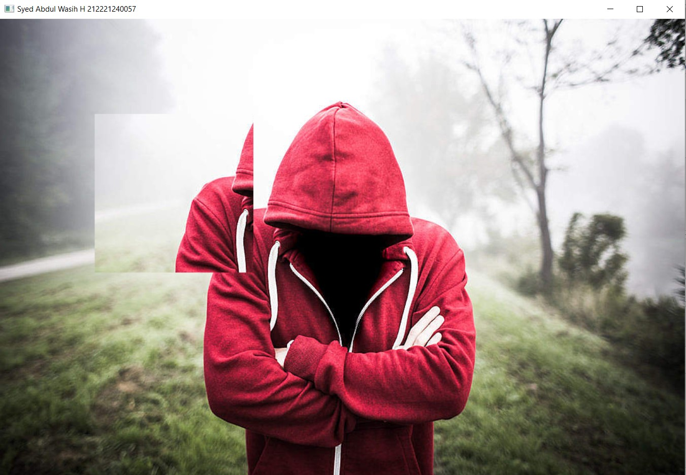

# Read and Write an Image:
## Aim:
#### To write a python program using OpenCV to do the following image manipulations.
##### i) Read, display, and write an image.
##### ii) Access the rows and columns in an image.
##### iii) Cut and paste a small portion of the image.

## Software Required:
Anaconda - Python 3.7
## Algorithm:
### Step1:
Choose an image and save it as a filename.jpg
### Step2:
Use imread(filename, flags) to read the file.
### Step3:
Use imshow(window_name, image) to display the image.
### Step4:
Use imwrite(filename, image) to write the image.
### Step5:
End the program and close the output image windows.
## Program:
```
# Developed By: Syed Abdul Wasih H
# Register Number : 212221240057
```

## i) To Read,display the image:
~~~
import cv2
color= cv2.imread('Alone.jpg',-1)
cv2.imshow('image',color)
cv2.waitKey(0)
~~~
## ii) To write the image:
~~~
import cv2
color= cv2.imread('Alone.jpg',-1)
cv2.imwrite('Alone.jpg',color)
~~~
## iii) Find the shape of the Image:
~~~
import cv2
color=cv2.imread('Alone.jpg',1)
print(color.shape)
~~~

## iv) To access rows and columns:
~~~
import cv2
import random
img= cv2.imread('Alone.jpg',-1)
for i in range(150):
    for j in range(img.shape[1]):
        img[i][j] = [random.randint(0,255),random.randint(0,255),random.randint(0,255)]
cv2.imshow('Alone.jpg',img)
cv2.waitKey(0)
~~~
## v) To cut and paste portion of image:
~~~
~~~
## Output:
### i) Read and display the image:

### ii)Write the image:
 
### iii)Shape of the Image:

### iv)Access rows and columns:


### v)Cut and paste portion of image:


## Result:
Thus the images are read, displayed, and written successfully using the python program.


